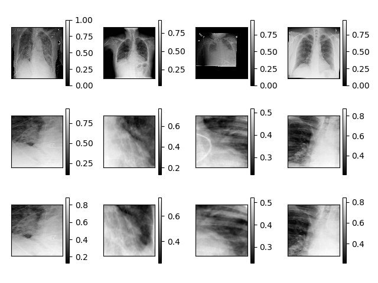

# roi-net
## What
roi-net a DenseNet based classification network to filter detection (Mask/Fast RCNN, SSD, Yolo, etc...) false-positive bounding box predictions.  
## Why
Detection networks are usually trained WITHOUT pure background cases, they always pick negative samples from background parts of image with target(s). Thus detection networks usually take some structures of backgound as (positive) clues for prediction. For example, cars are always found on the road in normal cases, so detection networks may use road features to predict cars, which is not always preferred.  
One of the results is more false-positive detections on certain backgound. This could be a serious problem for detection tasks with hard features (like lung opacity detection). Background features may be more obvious than positive features in these cases.  
Training detection networks with pure backgound cases may require lots of efforts. So we design roi-net to simply suppress false-positive detections.  
## How
roi-net is basically DenseNet with special handled inputs / outputs. Each predicted bbox is a sample.  
The inputs are 3-layer images. One layer for the whole image, one for ROI mask, and the other for resized ROI crop. We may crop ROIs in the network like RPNs, but cropping during sample loading is much easier and faster.  
For training / validation samples, we directly pick bboxes from targets and apply them to negative images, to generate negative bboxes. Also, we randomly pick negative bboxes from positive images.  
  
For outputs, we label the class of the whole image as well as the bbox. Since bbox is part of the whole image (there won't be positive bbox on a negative image), we encode the result into joint-states. eg. negative bbox on negative image = 0, and only keep the states that are allowed...  
## Training / Validation
```
usage: train-val.py [-h] [--lr LR] [--end_epoch END_EPOCH]
                    [--batch_size BATCH_SIZE] [--resume] [--transfer]
                    [--checkpoint CHECKPOINT] [--root ROOT] [--parallel]
                    [--device DEVICE] [--plot]

Pneumonia Verifier Training

optional arguments:
  -h, --help            show this help message and exit
  --lr LR               learning rate
  --end_epoch END_EPOCH
                        epcoh to stop training
  --batch_size BATCH_SIZE
                        batch size
  --resume, -r          resume from checkpoint
  --transfer            finetune pretrained model
  --checkpoint CHECKPOINT
                        checkpoint file path
  --root ROOT           dataset root path
  --parallel            run with multiple GPUs
  --device DEVICE       device (cuda / cpu)
  --plot                plot loss and accuracy
```
## Evaluation
```
usage: eval.py [-h] [--batch_size BATCH_SIZE] [--checkpoint CHECKPOINT]
               [--root ROOT] [--parallel] [--device DEVICE]

Pneumonia Verifier Evaluation

optional arguments:
  -h, --help            show this help message and exit
  --batch_size BATCH_SIZE
                        batch size
  --checkpoint CHECKPOINT
                        checkpoint file path
  --root ROOT           dataset root path
  --parallel            run with multiple GPUs
  --device DEVICE       device (cuda / cpu)
```
## Tips
### Custom dataset
You could implement your custom dataset. Transformation and augmentation should be implemented in YourCustomDataset.``__get_item__()``  
### Problemic imgaug bbox augmentation
Current version (0.2.6) of imgaug has bbox augmentation problem. It may produce zero area bbox and raise an internal assertion failure. One way to fix this is directly return original bbox if problemic bbox is detected (edit augment_bounding_boxes method in Augmenter class, in imgaug\augmenters\meta.py):
```python
def augment_bounding_boxes(self, bounding_boxes_on_images, hooks=None):
    """
    Augment image bounding boxes.

    This is the corresponding function to `augment_keypoints()`, just for
    bounding boxes.
    Usually you will want to call `augment_images()` with a list of images,
    e.g. `augment_images([A, B, C])` and then `augment_bounding_boxes()`
    with the corresponding list of bounding boxes on these images, e.g.
    `augment_bounding_boxes([Abb, Bbb, Cbb])`, where `Abb` are the
    bounding boxes on image `A`.

    Make sure to first convert the augmenter(s) to deterministic states
    before augmenting images and their corresponding bounding boxes,
    e.g. by
    >>> seq = iaa.Fliplr(0.5)
    >>> seq_det = seq.to_deterministic()
    >>> imgs_aug = seq_det.augment_images([A, B, C])
    >>> bbs_aug = seq_det.augment_keypoints([Abb, Bbb, Cbb])
    Otherwise, different random values will be sampled for the image
    and bounding box augmentations, resulting in different augmentations
    (e.g. images might be rotated by `30deg` and bounding boxes by
    `-10deg`). Also make sure to call `to_deterministic()` again for each
    new batch, otherwise you would augment all batches in the same way.

    Parameters
    ----------
    bounding_boxes_on_images : list of ia.BoundingBoxesOnImage
        The bounding boxes to augment.
        Expected is a list of ia.BoundingBoxesOnImage objects,
        each containing the bounding boxes of a single image.

    hooks : None or ia.HooksKeypoints, optional(default=None)
        HooksKeypoints object to dynamically interfere with the
        augmentation process.

    Returns
    -------
    result : list of ia.BoundingBoxesOnImage
        Augmented bounding boxes.

    """
    kps_ois = []
    for bbs_oi in bounding_boxes_on_images:
        kps = []
        for bb in bbs_oi.bounding_boxes:
            kps.extend(bb.to_keypoints())
        kps_ois.append(ia.KeypointsOnImage(kps, shape=bbs_oi.shape))

    kps_ois_aug = self.augment_keypoints(kps_ois, hooks=hooks)

    result = []
    for img_idx, kps_oi_aug in enumerate(kps_ois_aug):
        bbs_aug = []
        for i in sm.xrange(len(kps_oi_aug.keypoints) // 4):
            bb_kps = kps_oi_aug.keypoints[i*4:i*4+4]
            x1 = min([kp.x for kp in bb_kps])
            x2 = max([kp.x for kp in bb_kps])
            y1 = min([kp.y for kp in bb_kps])
            y2 = max([kp.y for kp in bb_kps])
            if (x2 > x1) and (y2 > y1):
                bbs_aug.append(
                    bounding_boxes_on_images[img_idx].bounding_boxes[i].copy(
                        x1=x1,
                        y1=y1,
                        x2=x2,
                        y2=y2
                    )
                )
            else:
                # problemic bbox, fall back to original
                bbs_aug.append(
                    bounding_boxes_on_images[img_idx].bounding_boxes[i].copy()
                )
        result.append(
            ia.BoundingBoxesOnImage(
                bbs_aug,
                shape=kps_oi_aug.shape
            )
        )
    return result
```